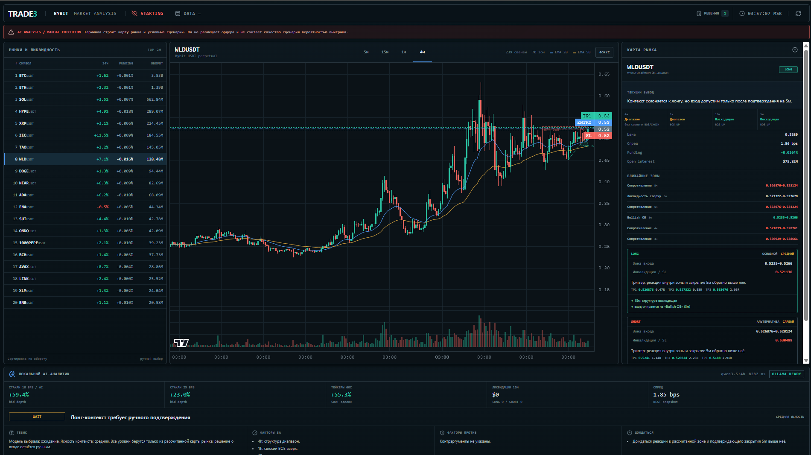

# Trade3

[](https://github.com/3oL1v/trade3/actions/workflows/ci.yml)

*A local decision-support terminal for discretionary futures trading.*

**English** | [Русский](#русский)



Trade3 reads the futures market and prepares a trade. It never places the order. You do that part.

It pulls public data from Bybit, works out the market structure, draws the zones and levels on a chart, asks a local LLM for a second opinion, and sizes the position with plain arithmetic. Then it waits for you. No code path places, edits, or cancels an order. That is the design.

This is a research and learning project. It has no proven trading edge, and this README says so up front. If you want a bot that prints money, look elsewhere. I would distrust anything that promises that.

## What it does

- **Picks the markets worth watching.** Ranks up to 20 liquid USDT perpetuals from an explicit allowlist, after filtering on spread, open interest, turnover, listing age, funding, and abnormal price moves. A turnover spike in a thin new contract cannot push an established market off the list.
- **Stays live.** Backfills 5m/15m/1h candles over REST, then keeps them current over Bybit's public WebSocket (ticker, kline, liquidations). It heartbeats every 20 seconds, reconnects with backoff, and flags itself as degraded when host and exchange clocks drift past five seconds.
- **Maps the structure.** Swing points, BOS/CHOCH, support and resistance, fair value gaps, inferred order blocks, liquidity pools, and trend lines, all computed from raw price data rather than a screenshot.
- **Reads the flow.** Depth-200 orderbook, recent taker trades, bid/ask imbalance inside 10 and 25 bps, and liquidation totals over 5, 15, and 60 minutes. The terminal labels partial depth and truncated trade samples instead of passing them off as complete.
- **Asks a local model.** Ollama receives the deterministic structure and flow snapshot and returns `LONG`, `SHORT`, or `WAIT`. It chooses from validated fact IDs only. It cannot invent a price level or free-text a market call. The UI then renders the explanation from the exact snapshot the model saw, so the chart and the reasoning stay in sync.
- **Does the risk math itself.** Position size comes from a fixed formula at 0.25% base risk per trade. The model cannot override it. When the stop-based size would need more margin than the account holds, the UI shows the smaller real position instead of an impossible one.

## What it refuses to do

- Place or manage orders. No endpoint exists for it.
- Let the LLM produce prices. It selects from enumerated facts.
- Trade on its own, or run anywhere but localhost.
- Promise a probability of profit. The setup score ranks quality from 0 to 100. That is all it does.

## The honest part: research results

I treated each strategy idea as a hypothesis and tried to kill it before trusting it. They died.

- **V1 (trend pullback)** failed its first fixed-parameter 30-day pilot.
- **V2 (trend continuation)** got its own spec and an untouched 30-day holdout. Profit factor 0.58, net expectancy −0.31R. Rejected.
- **V2 trial 485** looked strong on a five-symbol overnight search. So I froze the parameters and re-ran them on 20 symbols across three untouched periods, July 2025 to January 2026: 1,765 trades, profit factor 0.80, −259R cumulative, profitable in 0 of 3 windows. Rejected.

The terminal stays research-only because of this. No strategy is cleared for live calls. I keep the record in the README on purpose. The discipline behind it (frozen hypotheses, untouched holdouts, no in-sample tuning) is the part of the project I stand behind. I would rather have a negative result I can trust than a backtest I cannot.

## Architecture

```text
apps/api/    FastAPI backend: Bybit ingestion, scanner, structure analysis,
             flow, Ollama gateway, deterministic risk, backtest/replay tools
apps/web/    React + Lightweight Charts terminal: annotated chart, scenario
             cards, synced model review, flow metrics, position calculator
docs/        Architecture notes and decision/risk policy
prompts/     Versioned model prompts and the fact-selection schema
research/    Backtest, overnight search, and fixed-verification outputs
```

**Stack:** Python 3.12, FastAPI, Pydantic, httpx, websockets · React 19, TypeScript, Vite, Lightweight Charts v5 · Ollama for local inference · Bybit V5 public API, no key needed for market data.

## Running it

Clone:

```bash
git clone https://github.com/3oL1v/trade3.git
cd trade3
```

Backend (Windows / PowerShell):

```powershell
py -3.12 -m venv .venv
.\.venv\Scripts\python -m pip install -e "apps/api[dev]"
.\.venv\Scripts\python -m pytest apps/api/tests
.\.venv\Scripts\python -m uvicorn trade3_api.main:app --app-dir apps/api/src --reload
```

Web terminal:

```powershell
cd apps/web
npm install
npm run test      # vitest
npm run dev       # Vite at http://127.0.0.1:5173, proxies the API on :8000
```

The terminal shows the filtered universe, annotated charts, conditional scenarios, the Ollama review, Bybit flow, and a manual position-size calculator. No order buttons anywhere.

## Public endpoints

```text
GET /v1/markets/top?limit=20
GET /v1/markets/BTCUSDT/candles?interval=15&limit=200
GET /v1/live/status
GET /v1/intraday/candidates?limit=5
GET /v1/analysis/BTCUSDT
GET /v1/analysis/BTCUSDT/ai
GET /v1/flow/BTCUSDT
```

## Backtesting tools

The closed-candle, price-only replay and the search and verification harness ship as CLI commands:

```text
trade3-replay         Replay a strategy over historical closed candles
trade3-overnight      Run an overnight parameter search
trade3-verify-fixed   Re-test frozen parameters on untouched periods
```

Parameters stay fixed during a backtest run. The framework makes look-ahead tuning hard to do by accident.

## Status and roadmap

Active as a learning and research codebase, not a product.

Shipped:

- A manual decision journal with its own schema: accept, reject, or defer, plus
  the exact snapshot shown at decision time, separate from the retired
  deterministic-strategy journal. It tracks agreement with the AI verdict.
- Decision outcome tracking: resolve a call with a follow-up price and the
  journal computes the directional return, accept win rate, and average return.
- Automatic buy-and-hold BTC benchmark: each resolved call gets an excess return
  vs BTC, plus a "beats BTC" rate across accepts, so the journal reports alpha
  rather than raw return.

Next:

- Run the [shadow test](docs/shadow-test.md): collect 40+ resolved calls and
  check them against the pre-committed kill criterion before risking real money.

## Disclaimer

Not financial advice. Experimental software with no demonstrated edge. It does not execute trades. What you do with real money is your call.

---

## Русский

*Локальный терминал поддержки решений для дискреционной торговли фьючерсами.*

[English](#trade3) | **Русский**

Trade3 читает рынок фьючерсов и готовит сделку. Сам он ордер не ставит — это делаешь ты.

Терминал берёт публичные данные с Bybit, считает структуру рынка, рисует зоны и уровни на графике, спрашивает второе мнение у локальной LLM и считает размер позиции обычной арифметикой. После этого он останавливается и ждёт тебя. Ни одна строка кода не ставит, не меняет и не отменяет ордер. Так задумано.

Это исследовательский и учебный проект. Доказанного торгового преимущества у него нет, и этот README говорит об этом сразу. Если ищешь бота, который печатает деньги, тебе не сюда. Любому, кто такое обещает, я бы не доверял.

## Что он делает

- **Выбирает рынки, за которыми стоит следить.** Ранжирует до 20 ликвидных USDT-перпетуалов из явного списка допуска, после фильтров по спреду, открытому интересу, обороту, возрасту листинга, фандингу и аномальным движениям цены. Скачок оборота в тонком новом контракте не вытеснит устоявшийся рынок из списка.
- **Держит данные живыми.** Подтягивает свечи 5m/15m/1h через REST, затем обновляет их по публичному WebSocket Bybit (ticker, kline, ликвидации). Шлёт heartbeat каждые 20 секунд, переподключается с backoff и помечает себя как degraded, когда часы хоста и биржи расходятся больше чем на пять секунд.
- **Размечает структуру.** Swing-точки, BOS/CHOCH, поддержки и сопротивления, FVG, предполагаемые order block, зоны ликвидности и трендовые линии. Всё считается из сырых данных цены, а не со скриншота.
- **Читает поток.** Стакан глубиной 200, недавние тейкерские сделки, дисбаланс bid/ask внутри 10 и 25 bps, суммы ликвидаций за 5, 15 и 60 минут. Неполную глубину и обрезанную выборку сделок терминал помечает, а не выдаёт за полные.
- **Спрашивает локальную модель.** Ollama получает детерминированную структуру и снимок потока и возвращает `LONG`, `SHORT` или `WAIT`. Выбирает только из валидированных ID фактов. Цену или свободный текст придумать не может. Объяснение в интерфейсе строится из того же снимка, что видела модель, поэтому график и логика не расходятся.
- **Сам считает риск.** Размер позиции берётся из фиксированной формулы при базовом риске 0,25% на сделку. Модель не может это переопределить. Если размер по стопу требует больше маржи, чем есть на счёте, интерфейс показывает меньшую реальную позицию вместо невозможной.

## Чего он не делает

- Не ставит и не ведёт ордера. Эндпоинта для этого нет.
- Не даёт модели выдавать цены. Она выбирает из перечисленных фактов.
- Не торгует сам и не работает нигде, кроме localhost.
- Не обещает вероятность прибыли. Оценка сетапа ранжирует качество от 0 до 100, и только.

## Честная часть: результаты исследования

Я относился к каждой идее стратегии как к гипотезе и пытался убить её до того, как поверю. Они умерли.

- **V1 (откат по тренду)** провалила первый пилот на фиксированных параметрах за 30 дней.
- **V2 (продолжение тренда)** получила отдельную спецификацию и нетронутый holdout на 30 дней. Profit factor 0,58, чистое матожидание −0,31R. Отвергнута.
- **V2, trial 485** хорошо выглядела на ночном поиске по пяти символам. Я заморозил параметры и прогнал их на 20 символах за три нетронутых периода, июль 2025 — январь 2026: 1765 сделок, profit factor 0,80, −259R накопленно, прибыль в 0 из 3 окон. Отвергнута.

Из-за этого терминал остаётся research-only. Ни одна стратегия не допущена к реальным сигналам. Я держу эту запись в README намеренно. Дисциплина за ней (замороженные гипотезы, нетронутые holdout, отказ от подгонки in-sample) — то, за что я в этом проекте отвечаю. Лучше иметь отрицательный результат, которому я доверяю, чем бэктест, которому нет.

## Архитектура

```text
apps/api/    Бэкенд на FastAPI: ingest Bybit, scanner, анализ структуры,
             поток, шлюз Ollama, детерминированный риск, replay и бэктест
apps/web/    Терминал на React + Lightweight Charts: размеченный график,
             карточки сценариев, синхронное ревью модели, метрики потока,
             калькулятор позиции
docs/        Заметки по архитектуре и политика решений и риска
prompts/     Версионные промпты модели и схема выбора фактов
research/    Выводы бэктеста, ночного поиска и фиксированной проверки
```

**Стек:** Python 3.12, FastAPI, Pydantic, httpx, websockets · React 19, TypeScript, Vite, Lightweight Charts v5 · Ollama для локального инференса · публичный Bybit V5 API, ключ для рыночных данных не нужен.

## Запуск

Клонировать:

```bash
git clone https://github.com/3oL1v/trade3.git
cd trade3
```

Бэкенд (Windows / PowerShell):

```powershell
py -3.12 -m venv .venv
.\.venv\Scripts\python -m pip install -e "apps/api[dev]"
.\.venv\Scripts\python -m pytest apps/api/tests
.\.venv\Scripts\python -m uvicorn trade3_api.main:app --app-dir apps/api/src --reload
```

Веб-терминал:

```powershell
cd apps/web
npm install
npm run test      # vitest
npm run dev       # Vite на http://127.0.0.1:5173, проксирует API на :8000
```

Терминал показывает отфильтрованный набор рынков, размеченные графики, условные сценарии, ревью Ollama, поток Bybit и ручной калькулятор размера позиции. Кнопок для ордеров нигде нет.

## Публичные эндпоинты

```text
GET /v1/markets/top?limit=20
GET /v1/markets/BTCUSDT/candles?interval=15&limit=200
GET /v1/live/status
GET /v1/intraday/candidates?limit=5
GET /v1/analysis/BTCUSDT
GET /v1/analysis/BTCUSDT/ai
GET /v1/flow/BTCUSDT
```

## Инструменты бэктеста

Replay по закрытым свечам (только цена) и связка поиска и проверки поставляются как CLI-команды:

```text
trade3-replay         Прогон стратегии по историческим закрытым свечам
trade3-overnight      Ночной поиск параметров
trade3-verify-fixed   Перепроверка замороженных параметров на нетронутых периодах
```

Параметры остаются фиксированными во время прогона. Связка усложняет случайную подгонку с заглядыванием в будущее.

## Статус и планы

Активен как учебная и исследовательская кодовая база, а не продукт.

Сделано:

- Ручной журнал решений с собственной схемой: принять, отклонить или отложить,
  плюс точный снимок в момент решения, отдельно от выведенного из работы журнала
  стратегий. Считает совпадение с вердиктом AI.
- Отслеживание исхода решений: резолвишь решение ценой через горизонт, журнал
  считает направленную доходность, accept win rate и среднюю доходность.
- Автоматический бенчмарк buy-and-hold BTC: у каждого резолвнутого решения есть
  excess vs BTC и доля «бьёт BTC» по accept-решениям, поэтому журнал показывает
  alpha, а не просто доходность.

Дальше:

- Провести [shadow-тест](docs/shadow-test.md): собрать 40+ резолвнутых решений и
  сверить с заранее записанным kill-критерием, до того как рисковать деньгами.

## Дисклеймер

Не финансовый совет. Экспериментальный софт без доказанного преимущества. Он не исполняет сделки. Что ты делаешь с реальными деньгами — твоё решение.
